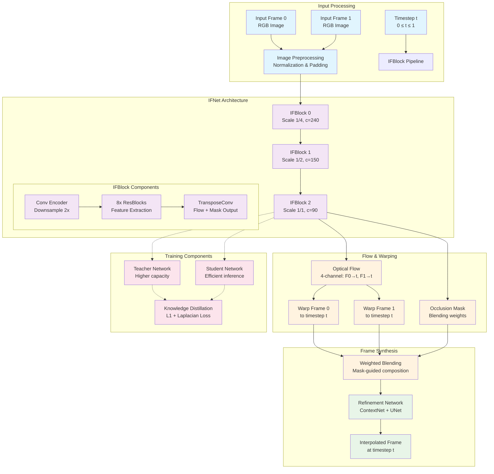
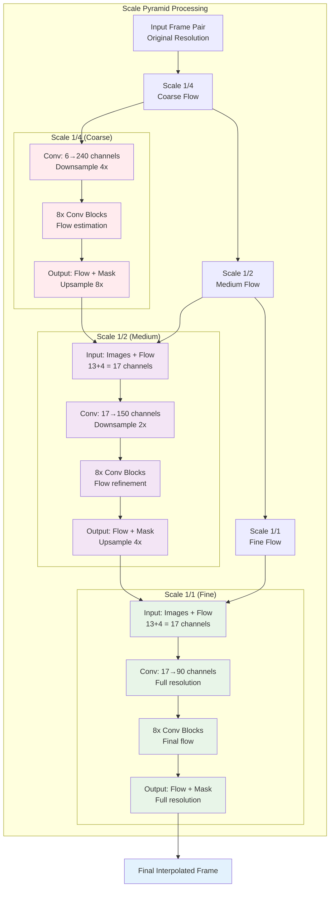
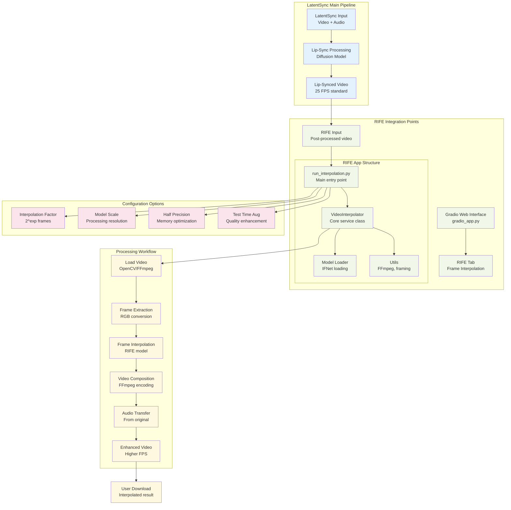
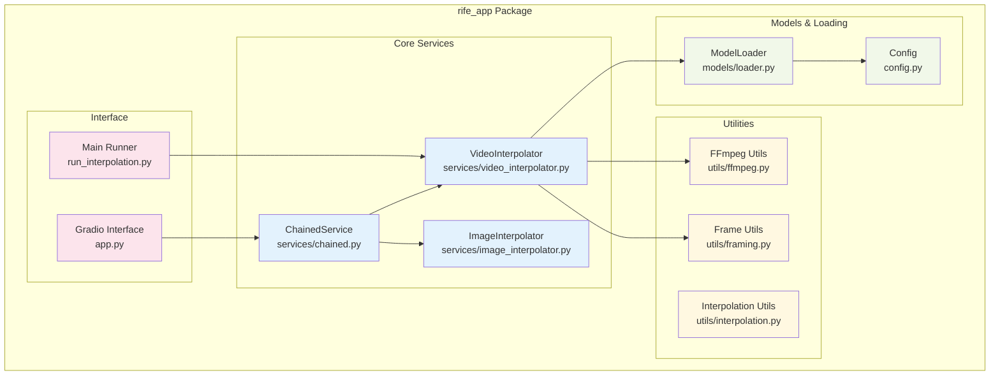

# ECCV2022-RIFE Documentation

## Overview

ECCV2022-RIFE (Real-Time Intermediate Flow Estimation) is a video frame interpolation system integrated into LatentSync for temporal upsampling. It generates intermediate frames between existing frames to increase video frame rate and create smooth slow-motion effects.

### Key Features
- **Real-time performance**: 30+ FPS for 2X 720p interpolation on RTX 2080 Ti
- **Arbitrary timestep interpolation**: Generate frames at any temporal position
- **Multi-scale processing**: Coarse-to-fine flow estimation
- **Teacher-student distillation**: Improved accuracy through knowledge transfer

## System Architecture

### RIFE Core Architecture Diagram



### Multi-Scale Processing Pipeline



### RIFE Integration with LatentSync



## Component Details

### Core Components

#### 1. **IFNet (Intermediate Flow Network)**
- **Location**: `model/IFNet.py`
- **Purpose**: Core neural network for optical flow estimation
- **Architecture**: 3-scale pyramid with IFBlocks
- **Input**: 6 channels (2 RGB frames)
- **Output**: 4-channel flow + 1-channel mask

#### 2. **IFBlock Architecture**

```mermaid
graph LR
    INPUT[Input Tensor<br/>Variable channels] --> CONV0[Conv Encoder<br/>Downsample 2x]
    CONV0 --> BLOCK1[Conv Block<br/>3x3, PReLU]
    BLOCK1 --> BLOCK2[Conv Block<br/>3x3, PReLU]
    BLOCK2 --> BLOCK3[Conv Block<br/>3x3, PReLU]
    BLOCK3 --> BLOCK4[Conv Block<br/>3x3, PReLU]
    BLOCK4 --> BLOCK5[Conv Block<br/>3x3, PReLU]
    BLOCK5 --> BLOCK6[Conv Block<br/>3x3, PReLU]
    BLOCK6 --> BLOCK7[Conv Block<br/>3x3, PReLU]
    BLOCK7 --> BLOCK8[Conv Block<br/>3x3, PReLU]
    BLOCK8 --> RESIDUAL[Residual Connection<br/>+]
    CONV0 --> RESIDUAL
    RESIDUAL --> DECONV[TransposeConv<br/>4x4, stride=2]
    DECONV --> OUTPUT[Flow + Mask<br/>5 channels total]
    
    classDef conv fill:#e3f2fd
    classDef block fill:#f1f8e9
    classDef output fill:#e8f5e8
    
    class CONV0,DECONV conv
    class BLOCK1,BLOCK2,BLOCK3,BLOCK4,BLOCK5,BLOCK6,BLOCK7,BLOCK8,RESIDUAL block
    class OUTPUT output
```


#### 3. **Model Variants**
- **IFNet**: Standard model for fixed timestep interpolation
- **IFNet_m**: Modified for arbitrary timestep interpolation
- **IFNet_HD**: High-definition variant for larger resolutions

#### 4. **Training Pipeline**
- **Teacher-Student Distillation**: Knowledge transfer for efficiency
- **Multi-scale Loss**: L1 + Laplacian loss at different scales
- **Flow Supervision**: Optional ground truth flow guidance

### Integration Architecture

#### RIFE App Structure


## Usage Patterns

### Command Line Interface

#### Basic Video Interpolation
```bash
# 2X interpolation (double frame rate)
python3 inference_video.py --exp=1 --video=input.mp4

# 4X interpolation (quadruple frame rate)  
python3 inference_video.py --exp=2 --video=input.mp4

# Custom scale factor for high resolution
python3 inference_video.py --exp=1 --video=4K_video.mp4 --scale=0.5
```

#### Image Interpolation
```bash
# 16X interpolation between two images
python3 inference_img.py --img frame1.png frame2.png --exp=4
```

### Gradio Integration

#### Integration Points
1. **Main Interface**: RIFE tab in LatentSync Gradio app
2. **Input**: Upload video file or use LatentSync output
3. **Configuration**: Interpolation factor, scale, precision settings
4. **Output**: Download interpolated video

#### Workflow Integration
```python
# Example integration in gradio_app.py
from rife_app.run_interpolation import main_interpolate

def interpolate_video(input_video, exp_factor):
    output_path = main_interpolate(
        input_video_path=input_video,
        output_dir_path="./temp_gradio/interpolated_videos/",
        exp=exp_factor,
        use_fp16=True
    )
    return output_path
```

## Technical Specifications

### Performance Characteristics

#### Speed Benchmarks
- **RTX 2080 Ti**: 30+ FPS for 2X 720p interpolation
- **Memory Usage**: ~4-6GB VRAM for HD processing
- **CPU Usage**: Moderate for video I/O operations

#### Quality Metrics
- **PSNR**: 35.282 (UCF101), 35.615 (Vimeo90K)
- **SSIM**: 0.9688 (UCF101), 0.9779 (Vimeo90K)  
- **Interpolation Error**: 1.956 (MiddleBury)

### Model Architecture Details

#### Network Parameters
- **IFNet**: ~7.5M parameters
- **IFNet_m**: ~8.2M parameters (arbitrary timestep)
- **Input Resolution**: Flexible, padded to multiples of 32

#### Training Configuration
- **Optimizer**: AdamW (lr=1e-6, weight_decay=1e-3)
- **Loss Functions**: L1 + Laplacian + Distillation
- **Batch Size**: 16-32 depending on resolution
- **Training Data**: Vimeo90K dataset

## File Structure Reference

```
ECCV2022-RIFE/
├── 📄 Core Files
│   ├── README.md                    # Project documentation
│   ├── requirements.txt             # Python dependencies
│   ├── inference_video.py          # CLI video interpolation
│   ├── inference_img.py            # CLI image interpolation
│   ├── train.py                    # Training script
│   └── dataset.py                  # Dataset loader
├── 🧠 Model Architecture
│   └── model/
│       ├── IFNet.py                # Standard interpolation network
│       ├── IFNet_m.py              # Arbitrary timestep variant
│       ├── IFNet_2R.py             # 2-frame recursive variant
│       ├── RIFE.py                 # Main model class
│       ├── warplayer.py            # Frame warping utilities
│       ├── refine.py               # Refinement networks
│       ├── loss.py                 # Loss functions
│       └── laplacian.py            # Laplacian pyramid loss
├── 🔧 RIFE App (LatentSync Integration)
│   └── rife_app/
│       ├── run_interpolation.py    # Main integration entry
│       ├── app.py                  # Gradio interface
│       ├── config.py               # Configuration settings
│       ├── models/
│       │   └── loader.py           # Model loading utilities
│       ├── services/
│       │   ├── video_interpolator.py  # Video processing service
│       │   ├── image_interpolator.py  # Image processing service
│       │   └── chained.py          # Service composition
│       └── utils/
│           ├── ffmpeg.py           # Video I/O operations
│           ├── framing.py          # Frame manipulation
│           └── interpolation.py    # Core interpolation logic
├── 📊 Evaluation & Benchmarks
│   └── benchmark/
│       ├── UCF101.py               # UCF101 evaluation
│       ├── Vimeo90K.py             # Vimeo90K evaluation
│       ├── HD.py                   # HD dataset evaluation
│       └── MiddleBury_Other.py     # MiddleBury evaluation
└── 🎬 Demo & Assets
    ├── demo/                       # Demo images and GIFs
    ├── docker/                     # Docker deployment
    └── temp_gradio/               # Temporary processing files
```

## Optimization Opportunities

### Performance Improvements
1. **Model Quantization**: INT8/FP16 for faster inference
2. **TensorRT Optimization**: GPU acceleration for deployment
3. **Batch Processing**: Multiple frame pairs simultaneously
4. **Memory Optimization**: Gradient checkpointing, CPU offloading

### Quality Enhancements
1. **Higher Resolution Models**: 4K-optimized variants
2. **Temporal Consistency**: Multi-frame context awareness
3. **Scene-Adaptive Processing**: Dynamic scale factors
4. **Advanced Loss Functions**: Perceptual and adversarial losses

### Integration Improvements
1. **Real-time Processing**: Streaming interpolation
2. **GPU Memory Management**: Dynamic allocation
3. **Error Handling**: Robust failure recovery
4. **User Experience**: Progress tracking, preview generation

This documentation provides comprehensive understanding of the ECCV2022-RIFE component within the LatentSync ecosystem, including detailed architecture diagrams, integration patterns, and technical specifications for enhanced video frame interpolation capabilities.