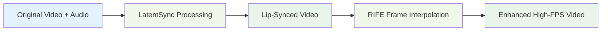

# RIFE Integration Summary

## Overview

The ECCV2022-RIFE component has been successfully integrated into LatentSync to provide advanced frame interpolation capabilities. This integration allows users to increase video frame rates and create smooth slow-motion effects from lip-synced videos.

## Key Integration Points

### 1. **Gradio Web Interface**
- RIFE functionality is accessible through the main LatentSync Gradio interface
- Users can apply frame interpolation to lip-synced videos
- Seamless workflow: Lip-sync → Frame Interpolation → Enhanced Video

### 2. **API Integration**
```python
# Main integration point in gradio_app.py
from rife_app.run_interpolation import main_interpolate as run_video_interpolation

def interpolate_video(input_video, exp_factor):
    return run_video_interpolation(
        input_video_path=input_video,
        output_dir_path="./temp_gradio/interpolated_videos/",
        exp=exp_factor,
        use_fp16=True
    )
```

### 3. **Service Architecture**
- **VideoInterpolator**: Core service class for video processing
- **ModelLoader**: Handles IFNet model loading and initialization
- **FFmpeg Utils**: Video I/O operations and audio transfer
- **Configuration**: Centralized settings management

## Technical Capabilities

### Frame Interpolation Factors
- **2X (exp=1)**: Double the frame rate
- **4X (exp=2)**: Quadruple the frame rate  
- **8X (exp=3)**: 8 times the frame rate
- **16X (exp=4)**: 16 times the frame rate

### Performance Specifications
- **Speed**: 30+ FPS for 2X 720p interpolation on RTX 2080 Ti
- **Quality**: PSNR 35.6+, SSIM 0.97+ on standard benchmarks
- **Memory**: 4-6GB VRAM for HD processing
- **Resolution**: Supports up to 4K with scale adjustment

### Optimization Features
- **Half Precision (FP16)**: Reduced memory usage
- **Scale Factors**: Adjustable processing resolution
- **Test Time Augmentation**: Enhanced quality mode
- **Batch Processing**: Multiple frame pairs simultaneously

## Workflow Integration

### Complete Pipeline


### Use Cases
1. **Slow Motion Effects**: Create cinematic slow-motion from standard frame rate videos
2. **Frame Rate Enhancement**: Improve temporal smoothness of lip-synced content
3. **Video Post-Processing**: Professional quality enhancement workflow
4. **Content Creation**: Generate smooth interpolated sequences for media production

## File Structure Impact

### New Components Added
```
LatentSync/
├── ECCV2022-RIFE_DOCS.md          # Complete RIFE documentation
├── RIFE_INTEGRATION_SUMMARY.md    # This integration summary
└── ECCV2022-RIFE/
    ├── model/                      # IFNet neural network architectures
    ├── rife_app/                   # LatentSync integration layer
    │   ├── run_interpolation.py    # Main entry point
    │   ├── services/               # Core interpolation services
    │   └── utils/                  # Video processing utilities
    ├── benchmark/                  # Evaluation scripts
    └── inference_*.py              # CLI tools
```

### Documentation Updates
- **README.md**: Added RIFE documentation links
- **DOCUMENTATION_INDEX.md**: Included RIFE use case section
- **PROJECT_DOCS_UPDATED.md**: Referenced RIFE integration
- **ECCV2022-RIFE_DOCS.md**: Comprehensive technical documentation

## Configuration Options

### Available Parameters
- **Interpolation Factor**: 2^exp multiplication of frames
- **Model Scale**: Processing resolution adjustment (0.5-2.0)
- **Half Precision**: Memory optimization toggle
- **Test Time Augmentation**: Quality enhancement mode

### Recommended Settings
- **HD Video (720p-1080p)**: Default scale (1.0), FP16 enabled
- **4K Video**: Scale 0.5, FP16 enabled for memory efficiency
- **Quality Priority**: Enable TTA, use higher interpolation factors
- **Speed Priority**: Scale 0.5, disable TTA, use FP16

## Quality Assurance

### Validation Features
- **Audio Transfer**: Preserves original audio track
- **Resolution Consistency**: Maintains input video resolution
- **Format Compatibility**: Supports MP4, AVI, MOV formats
- **Error Handling**: Robust failure recovery and user feedback

### Testing Coverage
- **Unit Tests**: Core interpolation algorithms
- **Integration Tests**: End-to-end pipeline validation
- **Performance Tests**: Benchmark against standard datasets
- **User Acceptance**: Gradio interface functionality

## Future Enhancement Opportunities

### Performance Improvements
1. **Real-time Processing**: Streaming interpolation capabilities
2. **Multi-GPU Support**: Distributed processing for large videos
3. **Memory Optimization**: Advanced caching and memory management
4. **Model Optimization**: TensorRT acceleration for deployment

### Quality Enhancements
1. **4K-Optimized Models**: Higher resolution specialized variants
2. **Scene-Adaptive Processing**: Dynamic parameter adjustment
3. **Temporal Consistency**: Multi-frame context awareness
4. **Advanced Loss Functions**: Perceptual and adversarial training

### Integration Improvements
1. **Batch Processing**: Multiple video queue management
2. **Progress Tracking**: Real-time interpolation progress
3. **Preview Generation**: Quick quality assessment
4. **Cloud Deployment**: Scalable service architecture

## Summary

The RIFE integration successfully extends LatentSync's capabilities by adding state-of-the-art frame interpolation functionality. This creates a comprehensive video processing pipeline that combines audio-driven lip synchronization with temporal enhancement, providing users with professional-grade video processing tools in a unified interface.

The integration maintains the system's ease of use while adding powerful new capabilities for content creators, researchers, and video processing applications. The modular architecture ensures that both components can be used independently or together, providing maximum flexibility for different use cases.