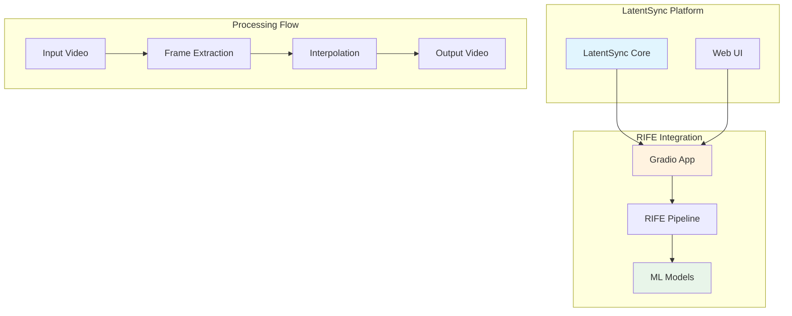
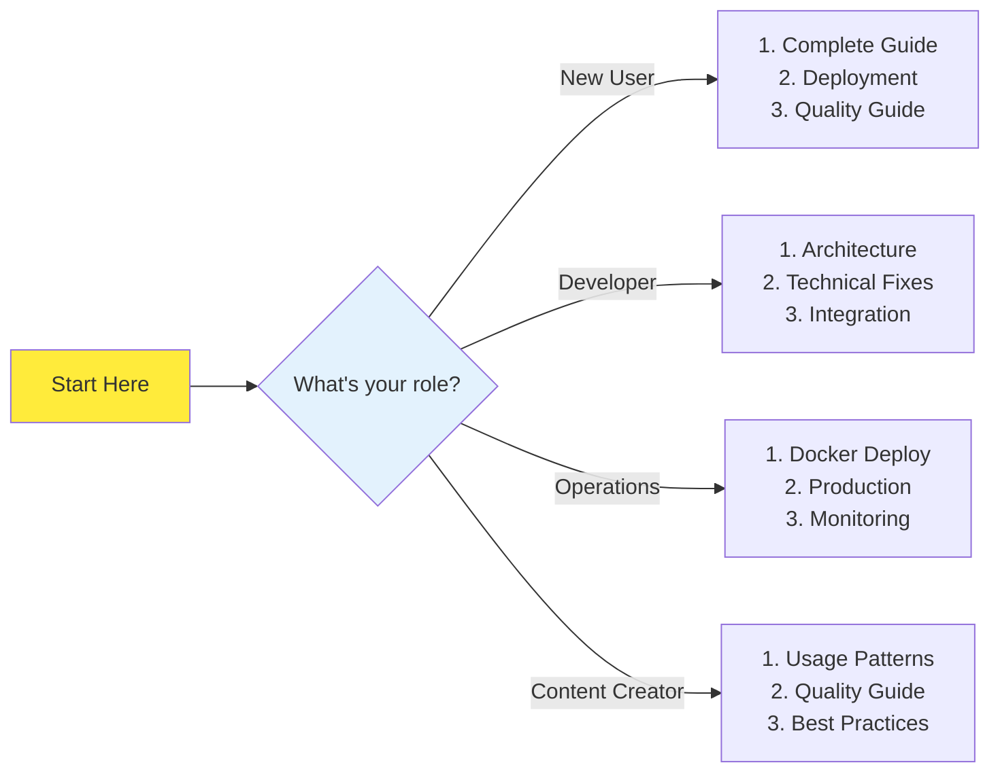
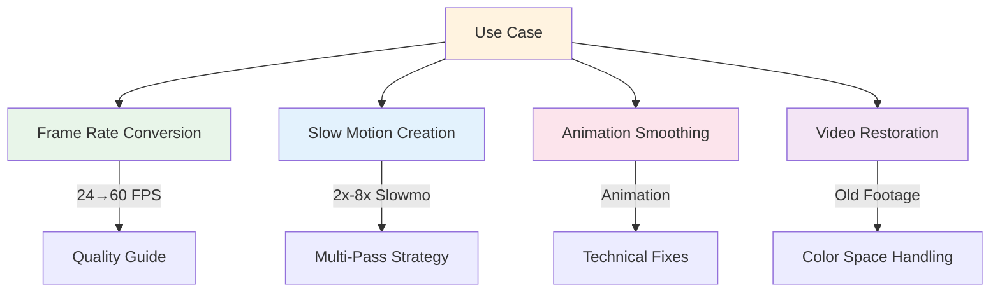
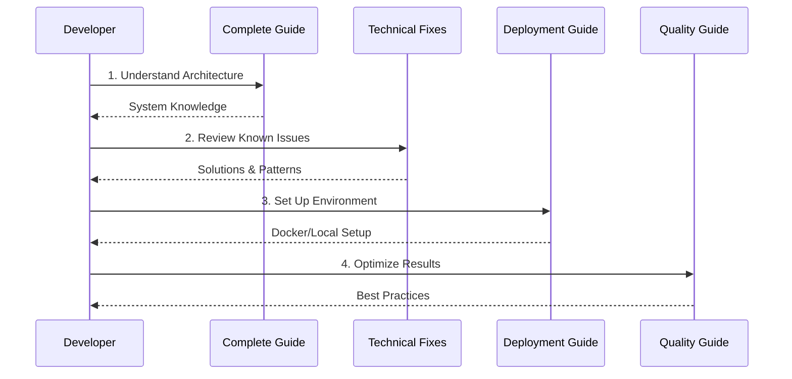

# RIFE Documentation Hub

Welcome to the comprehensive RIFE documentation. This hub provides everything you need to understand, deploy, and optimize the ECCV2022-RIFE frame interpolation system integrated into LatentSync.

## 🏗️ System Overview



## 📚 Documentation Structure

### Visual Overview

#### 🎯 [System Overview](./SYSTEM_OVERVIEW.md) **NEW**
**High-level visual architecture** - Start here for the big picture
- 🏗️ Complete system architecture diagram
- 🔄 Data flow visualization 
- ⚖️ Quality vs performance trade-offs
- 🔌 Component interaction maps
- 🚀 Deployment architecture options

### Core Documentation

#### 📖 [RIFE Complete Guide](./RIFE_COMPLETE_GUIDE.md)
**The comprehensive technical reference** - Your primary source for understanding RIFE
- 🏛️ System architecture with 10+ visual diagrams
- 🔌 Complete LatentSync integration details
- 🧩 Component specifications and API documentation
- 💻 Code structure and development patterns
- 🎨 UI workflows and user interface design

#### 🚀 [Deployment Guide](./DEPLOYMENT_GUIDE.md)
**Production-ready deployment strategies** - From local to cloud scale
- 🐳 Docker deployment (recommended approach)
- 💻 Local installation and development setup
- ☁️ Production deployment best practices
- 📊 Monitoring, scaling, and optimization
- 🔧 Troubleshooting common issues

#### 🔧 [Technical Solutions](./TECHNICAL_FIXES.md)
**Engineering excellence and problem solving** - Battle-tested solutions
- 🎨 Color space handling (BT.709 compliance)
- 📐 Tensor dimension management
- 🔢 Float32/16-bit precision optimization
- 🎯 Spatial alignment algorithms
- ⚡ Performance impact analysis

#### 🎯 [Quality & Optimization](./QUALITY_AND_OPTIMIZATION.md)
**Research-driven quality improvements** - Achieving professional results
- 🔬 Critical discovery: Multi-pass strategy
- 📈 Quality vs. performance trade-offs
- 💾 Disk-based interpolation architecture
- 🧠 Memory optimization techniques
- 🎬 Professional workflow recommendations

## 🗺️ Quick Start Paths



## 🔍 Topic Deep Dives

### Architecture & Design
- [Multi-Scale Processing Pipeline](./RIFE_COMPLETE_GUIDE.md#multi-scale-processing-pipeline)
- [LatentSync Integration Architecture](./RIFE_COMPLETE_GUIDE.md#rife-integration-with-latentsync)
- [Component Communication](./RIFE_COMPLETE_GUIDE.md#component-details)
- [Model Loading Strategy](./RIFE_COMPLETE_GUIDE.md#model-management)

### Quality Engineering
- [2x Pass Strategy](./QUALITY_AND_OPTIMIZATION.md#for-maximum-quality-use-multiple-2x-passes)
- [Artifact Analysis](./QUALITY_AND_OPTIMIZATION.md#root-cause-analysis)
- [Disk-Based Architecture](./QUALITY_AND_OPTIMIZATION.md#disk-based-interpolation-solution)
- [Memory Optimization](./QUALITY_AND_OPTIMIZATION.md#memory-optimization-strategies)

### Technical Excellence
- [Color Space Pipeline](./TECHNICAL_FIXES.md#color-space-fixes)
- [Tensor Management](./TECHNICAL_FIXES.md#tensor-size-mismatch-fixes)
- [Precision Handling](./TECHNICAL_FIXES.md#precision-optimization-strategies)
- [Performance Tuning](./TECHNICAL_FIXES.md#performance-impact)

### Deployment & Scale
- [Container Architecture](./DEPLOYMENT_GUIDE.md#docker-deployment-recommended)
- [Production Setup](./DEPLOYMENT_GUIDE.md#production-deployment)
- [Scaling Strategies](./DEPLOYMENT_GUIDE.md#scaling-strategies)
- [Monitoring Stack](./DEPLOYMENT_GUIDE.md#monitoring-configuration)

## 🎯 Common Use Cases



## 📊 Performance & Quality Matrix

| Interpolation Factor | Strategy | Quality | Speed | Memory |
|---------------------|----------|---------|--------|---------|
| 2x | Single Pass | ⭐⭐⭐⭐⭐ | ⚡⚡⚡⚡⚡ | 💾 |
| 4x | Single Pass | ⭐⭐⭐ | ⚡⚡⚡⚡ | 💾💾 |
| 4x | Multi-Pass (2x2) | ⭐⭐⭐⭐⭐ | ⚡⚡⚡ | 💾 |
| 8x | Single Pass | ⭐⭐ | ⚡⚡⚡ | 💾💾💾 |
| 8x | Multi-Pass (2x2x2) | ⭐⭐⭐⭐⭐ | ⚡⚡ | 💾 |
| 16x+ | Disk-Based Multi-Pass | ⭐⭐⭐⭐⭐ | ⚡ | 💾 |

## 🛠️ Development Workflow



## 📈 Documentation Evolution

### What's New
- ✨ **Unified Structure**: Consolidated from 9 scattered files to 4 comprehensive guides
- 🎨 **Visual Diagrams**: Added Mermaid diagrams for better understanding
- 🔗 **Cross-References**: Enhanced navigation between related topics
- 📊 **Performance Matrix**: Clear quality/speed trade-offs
- 🛤️ **Learning Paths**: Role-based navigation guides

### Legacy Documentation Map
```
Old Structure (9 files) → New Structure (4 files)
├── ECCV2022-RIFE_DOCS.md ──────────┐
├── INTEGRATION_GUIDE.md ────────────┼─→ RIFE_COMPLETE_GUIDE.md
├── rife_app/RIFE_APP_DIAGRAMS.md ──┘
├── README-Docker.md ────────────────→ DEPLOYMENT_GUIDE.md
├── COLOR_SPACE_DOCUMENTATION.md ────┐
├── TENSOR_SIZE_FIX_DOCUMENTATION.md ┼─→ TECHNICAL_FIXES.md
├── DISK_BASED_INTERPOLATION.md ─────┐
└── RIFE_INTERPOLATION_QUALITY.md ────┼─→ QUALITY_AND_OPTIMIZATION.md
```

## 🚀 Getting Started

### For First-Time Users
1. **Read** [System Overview](./RIFE_COMPLETE_GUIDE.md#system-overview) (10 min)
2. **Deploy** using [Docker Guide](./DEPLOYMENT_GUIDE.md#docker-deployment-recommended) (15 min)
3. **Test** with [Example Workflows](./RIFE_COMPLETE_GUIDE.md#usage-patterns) (5 min)
4. **Optimize** using [Quality Guidelines](./QUALITY_AND_OPTIMIZATION.md#best-practices--recommendations) (10 min)

### For Developers
1. **Study** [Architecture Diagrams](./RIFE_COMPLETE_GUIDE.md#system-architecture)
2. **Review** [Technical Solutions](./TECHNICAL_FIXES.md)
3. **Implement** following [Code Patterns](./RIFE_COMPLETE_GUIDE.md#code-structure)
4. **Test** using [Integration Points](./RIFE_COMPLETE_GUIDE.md#integration-points)

### For Production Teams
1. **Deploy** with [Production Guide](./DEPLOYMENT_GUIDE.md#production-deployment)
2. **Monitor** using [Observability Stack](./DEPLOYMENT_GUIDE.md#monitoring-configuration)
3. **Scale** following [Scaling Strategies](./DEPLOYMENT_GUIDE.md#scaling-strategies)
4. **Troubleshoot** with [Common Issues](./DEPLOYMENT_GUIDE.md#troubleshooting)

## 📞 Support & Contribution

- **Issues**: Check [Technical Fixes](./TECHNICAL_FIXES.md) first
- **Performance**: See [Quality Guide](./QUALITY_AND_OPTIMIZATION.md)
- **Deployment**: Consult [Deployment Guide](./DEPLOYMENT_GUIDE.md)
- **Architecture**: Reference [Complete Guide](./RIFE_COMPLETE_GUIDE.md)

---

*This documentation hub provides comprehensive coverage of RIFE integration with LatentSync. All information is organized for maximum clarity and ease of navigation.*