# RIFE Complete Guide

## Overview

ECCV2022-RIFE (Real-Time Intermediate Flow Estimation) is a video frame interpolation system integrated into LatentSync for temporal upsampling. It generates intermediate frames between existing frames to increase video frame rate and create smooth slow-motion effects.

### Key Features
- **Real-time performance**: 30+ FPS for 2X 720p interpolation on RTX 2080 Ti
- **Arbitrary timestep interpolation**: Generate frames at any temporal position
- **Multi-scale processing**: Coarse-to-fine flow estimation
- **Teacher-student distillation**: Improved accuracy through knowledge transfer

## System Architecture

### RIFE Core Architecture Diagram

```mermaid
graph TB
    subgraph "Input Processing"
        I0[Input Frame 0<br/>RGB Image] --> PREP[Image Preprocessing<br/>Normalization & Padding]
        I1[Input Frame 1<br/>RGB Image] --> PREP
        T[Timestep t<br/>0 ≤ t ≤ 1] --> IFB[IFBlock Pipeline]
    end
    
    subgraph "IFNet Architecture"
        PREP --> IFB0[IFBlock 0<br/>Scale 1/4, c=240]
        IFB0 --> IFB1[IFBlock 1<br/>Scale 1/2, c=150]
        IFB1 --> IFB2[IFBlock 2<br/>Scale 1/1, c=90]
        
        subgraph "IFBlock Components"
            CONV0[Conv Encoder<br/>Downsample 2x]
            RESBLOCK[8x ResBlocks<br/>Feature Extraction]
            DECONV[TransposeConv<br/>Flow + Mask Output]
        end
        
        CONV0 --> RESBLOCK
        RESBLOCK --> DECONV
    end
    
    subgraph "Flow & Warping"
        IFB2 --> FLOW[Optical Flow<br/>4-channel: F0→t, F1→t]
        FLOW --> WARP0[Warp Frame 0<br/>to timestep t]
        FLOW --> WARP1[Warp Frame 1<br/>to timestep t]
        IFB2 --> MASK[Occlusion Mask<br/>Blending weights]
    end
    
    subgraph "Frame Synthesis"
        WARP0 --> BLEND[Weighted Blending<br/>Mask-guided composition]
        WARP1 --> BLEND
        MASK --> BLEND
        BLEND --> REFINE[Refinement Network<br/>ContextNet + UNet]
        REFINE --> OUTPUT[Interpolated Frame<br/>at timestep t]
    end
    
    subgraph "Training Components"
        TEACHER[Teacher Network<br/>Higher capacity]
        STUDENT[Student Network<br/>Efficient inference]
        DISTILL[Knowledge Distillation<br/>L1 + Laplacian Loss]
    end
    
    IFB2 -.-> TEACHER
    TEACHER -.-> DISTILL
    IFB2 -.-> STUDENT
    STUDENT -.-> DISTILL
    
    classDef input fill:#e1f5fe
    classDef processing fill:#f3e5f5
    classDef flow fill:#fff3e0
    classDef output fill:#e8f5e8
    classDef training fill:#fce4ec
    
    class I0,I1,T,PREP input
    class IFB0,IFB1,IFB2,CONV0,RESBLOCK,DECONV processing
    class FLOW,WARP0,WARP1,MASK,BLEND flow
    class REFINE,OUTPUT output
    class TEACHER,STUDENT,DISTILL training
```



### Multi-Scale Processing Pipeline


### RIFE Integration with LatentSync


## Component Details

### Core Components

#### 1. **IFNet (Intermediate Flow Network)**
- **Location**: `model/IFNet.py`
- **Purpose**: Core neural network for optical flow estimation
- **Architecture**: 3-scale pyramid with IFBlocks
- **Input**: 6 channels (2 RGB frames)
- **Output**: 4-channel flow + 1-channel mask

#### 2. **IFBlock Architecture**


#### 3. **Model Variants**
- **IFNet**: Standard model for fixed timestep interpolation
- **IFNet_m**: Modified for arbitrary timestep interpolation
- **IFNet_HD**: High-definition variant for larger resolutions

#### 4. **Training Pipeline**
- **Teacher-Student Distillation**: Knowledge transfer for efficiency
- **Multi-scale Loss**: L1 + Laplacian loss at different scales
- **Flow Supervision**: Optional ground truth flow guidance

### Integration Architecture

#### RIFE App Structure


## Usage Patterns

### Command Line Interface

#### Basic Video Interpolation
```bash
# 2X interpolation (double frame rate)
python3 inference_video.py --exp=1 --video=input.mp4

# 4X interpolation (quadruple frame rate)  
python3 inference_video.py --exp=2 --video=input.mp4

# Custom scale factor for high resolution
python3 inference_video.py --exp=1 --video=4K_video.mp4 --scale=0.5
```

#### Image Interpolation
```bash
# 16X interpolation between two images
python3 inference_img.py --img frame1.png frame2.png --exp=4
```

### Gradio Integration

#### Integration Points
1. **Main Interface**: RIFE tab in LatentSync Gradio app
2. **Input**: Upload video file or use LatentSync output
3. **Configuration**: Interpolation factor, scale, precision settings
4. **Output**: Download interpolated video

#### Workflow Integration
```python
# Example integration in gradio_app.py
from rife_app.run_interpolation import main_interpolate

def interpolate_video(input_video, exp_factor):
    output_path = main_interpolate(
        input_video_path=input_video,
        output_dir_path="./temp_gradio/interpolated_videos/",
        exp=exp_factor,
        use_fp16=True
    )
    return output_path
```

## Technical Specifications

### Performance Characteristics

#### Speed Benchmarks
- **RTX 2080 Ti**: 30+ FPS for 2X 720p interpolation
- **Memory Usage**: ~4-6GB VRAM for HD processing
- **CPU Usage**: Moderate for video I/O operations

#### Quality Metrics
- **PSNR**: 35.282 (UCF101), 35.615 (Vimeo90K)
- **SSIM**: 0.9688 (UCF101), 0.9779 (Vimeo90K)  
- **Interpolation Error**: 1.956 (MiddleBury)

### Model Architecture Details

#### Network Parameters
- **IFNet**: ~7.5M parameters
- **IFNet_m**: ~8.2M parameters (arbitrary timestep)
- **Input Resolution**: Flexible, padded to multiples of 32

#### Training Configuration
- **Optimizer**: AdamW (lr=1e-6, weight_decay=1e-3)
- **Loss Functions**: L1 + Laplacian + Distillation
- **Batch Size**: 16-32 depending on resolution
- **Training Data**: Vimeo90K dataset

## UI Tab Structure

### Tab 1: Select Frames from Video


### Tab 2: Interpolate Between Images


### Tab 3: Chained Video Interpolation

```mermaid
graph TD
    A[Tab 3: Chained Video Interpolation] --> B[Video Inputs]
    B --> C[Anchor Video/Start]
    B --> D[Middle Video]
    B --> E[End Video]
    
    F[Configuration] --> G[Number of Passes]
    F --> H[Final FPS]
    F --> I[Interpolation Method]
    
    I --> J{Method Choice}
    J -->|Standard| K[image_interpolation]
    J -->|Disk-Based| L[disk_based]
    
    M[Generate Button] --> N[ChainedInterpolator.interpolate]
    
    N --> O[Extract transition frames]
    O --> P[Anchor last → Middle first]
    O --> Q[Middle last → End first]
    
    P --> R[Generate transition 1]
    Q --> S[Generate transition 2]
    
    R --> T[Merge Videos]
    S --> T
    T --> U[Anchor + Trans1 + Middle + Trans2 + End]
    
    U --> V[Output Chained Video]
    U --> W[Status Message]
```



### Tab 4: Video Interpolation


### Tab 5: Video Re-encoding


## File Structure Reference

```
ECCV2022-RIFE/
├── 📄 Core Files
│   ├── README.md                    # Project documentation
│   ├── requirements.txt             # Python dependencies
│   ├── inference_video.py          # CLI video interpolation
│   ├── inference_img.py            # CLI image interpolation
│   ├── train.py                    # Training script
│   └── dataset.py                  # Dataset loader
├── 🧠 Model Architecture
│   └── model/
│       ├── IFNet.py                # Standard interpolation network
│       ├── IFNet_m.py              # Arbitrary timestep variant
│       ├── IFNet_2R.py             # 2-frame recursive variant
│       ├── RIFE.py                 # Main model class
│       ├── warplayer.py            # Frame warping utilities
│       ├── refine.py               # Refinement networks
│       ├── loss.py                 # Loss functions
│       └── laplacian.py            # Laplacian pyramid loss
├── 🔧 RIFE App (LatentSync Integration)
│   └── rife_app/
│       ├── run_interpolation.py    # Main integration entry
│       ├── app.py                  # Gradio interface
│       ├── config.py               # Configuration settings
│       ├── models/
│       │   └── loader.py           # Model loading utilities
│       ├── services/
│       │   ├── video_interpolator.py  # Video processing service
│       │   ├── image_interpolator.py  # Image processing service
│       │   └── chained.py          # Service composition
│       └── utils/
│           ├── ffmpeg.py           # Video I/O operations
│           ├── framing.py          # Frame manipulation
│           └── interpolation.py    # Core interpolation logic
├── 📊 Evaluation & Benchmarks
│   └── benchmark/
│       ├── UCF101.py               # UCF101 evaluation
│       ├── Vimeo90K.py             # Vimeo90K evaluation
│       ├── HD.py                   # HD dataset evaluation
│       └── MiddleBury_Other.py     # MiddleBury evaluation
├── 📚 Documentation
│   └── docs/                       # Organized documentation
│       ├── RIFE_COMPLETE_GUIDE.md  # This comprehensive guide
│       ├── DEPLOYMENT_GUIDE.md     # Docker and deployment
│       ├── TECHNICAL_FIXES.md      # Color space and tensor fixes
│       └── QUALITY_AND_OPTIMIZATION.md # Quality analysis and optimization
└── 🎬 Demo & Assets
    ├── demo/                       # Demo images and GIFs
    ├── docker/                     # Docker deployment
    └── temp_gradio/               # Temporary processing files
```

## Integration Points

### 1. Gradio Web Interface
- RIFE functionality accessible through main LatentSync interface
- Seamless workflow: Lip-sync → Frame Interpolation → Enhanced Video
- Real-time progress tracking and quality assessment

### 2. API Integration
```python
# Main integration point in gradio_app.py
from rife_app.run_interpolation import main_interpolate as run_video_interpolation

def interpolate_video(input_video, exp_factor):
    return run_video_interpolation(
        input_video_path=input_video,
        output_dir_path="./temp_gradio/interpolated_videos/",
        exp=exp_factor,
        use_fp16=True
    )
```

### 3. Service Architecture
- **VideoInterpolator**: Core service class for video processing
- **ImageInterpolator**: Image-to-image interpolation
- **ChainedInterpolator**: Multi-stage video processing
- **SimpleVideoReencoder**: Video format conversion
- **Configuration**: Centralized settings management

## Technical Capabilities

### Frame Interpolation Factors
- **2X (exp=1)**: Double the frame rate - **Recommended for quality**
- **4X (exp=2)**: Quadruple the frame rate - Good balance
- **8X (exp=3)**: 8 times the frame rate - Quality trade-offs
- **16X (exp=4)**: 16 times the frame rate - Specialized use

### Performance Specifications
- **Speed**: 30+ FPS for 2X 720p interpolation on RTX 2080 Ti
- **Quality**: PSNR 35.6+, SSIM 0.97+ on standard benchmarks
- **Memory**: 4-6GB VRAM for HD processing
- **Resolution**: Supports up to 4K with scale adjustment

### Optimization Features
- **Half Precision (FP16)**: Reduced memory usage
- **Scale Factors**: Adjustable processing resolution (0.5-2.0)
- **Test Time Augmentation**: Enhanced quality mode
- **Batch Processing**: Multiple frame pairs simultaneously

## Configuration Options

### Available Parameters
- **Interpolation Factor (exp)**: 2^exp multiplication of frames (1-4)
- **Model Scale**: Processing resolution adjustment (0.5-2.0)
- **Half Precision**: Memory optimization toggle
- **Test Time Augmentation**: Quality enhancement mode

### Recommended Settings

#### HD Video (720p-1080p)
- Scale: 1.0 (default)
- FP16: Enabled
- Interpolation: 2X for best quality

#### 4K Video
- Scale: 0.5 (memory efficiency)
- FP16: Enabled
- Interpolation: 2X recommended

#### Quality Priority
- Enable TTA (Test Time Augmentation)
- Use multiple 2X passes instead of high factors
- Higher resolution processing

#### Speed Priority
- Scale: 0.5
- Disable TTA
- Use FP16
- Single interpolation pass

## Use Cases

### Primary Applications
1. **Slow Motion Effects**: Create cinematic slow-motion from standard frame rate videos
2. **Frame Rate Enhancement**: Improve temporal smoothness of lip-synced content
3. **Video Post-Processing**: Professional quality enhancement workflow
4. **Content Creation**: Generate smooth interpolated sequences for media production

### Workflow Integration
- **Post-Lip-Sync Processing**: Apply frame interpolation after lip synchronization
- **Quality Enhancement**: Improve temporal smoothness without audio sync issues
- **Creative Effects**: Generate high-frame-rate content for artistic purposes
- **Professional Video**: Enhance commercial video content quality

## Optimization Opportunities

### Performance Improvements
1. **Model Quantization**: INT8/FP16 for faster inference
2. **TensorRT Optimization**: GPU acceleration for deployment
3. **Batch Processing**: Multiple frame pairs simultaneously
4. **Memory Optimization**: Gradient checkpointing, CPU offloading

### Quality Enhancements
1. **Higher Resolution Models**: 4K-optimized variants
2. **Temporal Consistency**: Multi-frame context awareness
3. **Scene-Adaptive Processing**: Dynamic scale factors
4. **Advanced Loss Functions**: Perceptual and adversarial losses

### Integration Improvements
1. **Real-time Processing**: Streaming interpolation
2. **GPU Memory Management**: Dynamic allocation
3. **Error Handling**: Robust failure recovery
4. **User Experience**: Progress tracking, preview generation

## Quick Start Guide

### Web Interface
1. Access through LatentSync Gradio interface
2. Upload lip-synced video
3. Select interpolation factor (recommend 2X)
4. Configure quality settings
5. Process and download enhanced video

### Command Line
```bash
# Direct processing
python inference_video.py --input video.mp4 --exp 1 --output enhanced.mp4

# Via rife_app
python rife_app/run_interpolation.py --input video.mp4 --exp 1
```

### API Integration
```python
from rife_app.run_interpolation import main_interpolate

result = main_interpolate(
    input_video_path="input.mp4",
    output_dir_path="./output/",
    exp=1,  # 2X interpolation
    use_fp16=True
)
```

## Summary

The RIFE integration successfully extends LatentSync's capabilities by adding state-of-the-art frame interpolation functionality. This creates a comprehensive video processing pipeline that combines audio-driven lip synchronization with temporal enhancement, providing users with professional-grade video processing tools in a unified interface.

The integration maintains system ease of use while adding powerful capabilities for content creators, researchers, and video processing applications. The modular architecture ensures both components can be used independently or together, providing maximum flexibility for different use cases.

### Key Benefits
- **Professional Quality**: State-of-the-art frame interpolation
- **Seamless Integration**: Works perfectly with LatentSync workflow
- **Flexible Configuration**: Multiple quality and performance options
- **Comprehensive Documentation**: Complete technical and usage guides
- **Future-Ready**: Designed for extensibility and enhancement

This documentation provides comprehensive understanding of the ECCV2022-RIFE component within the LatentSync ecosystem, including detailed architecture diagrams, integration patterns, and technical specifications for enhanced video frame interpolation capabilities.