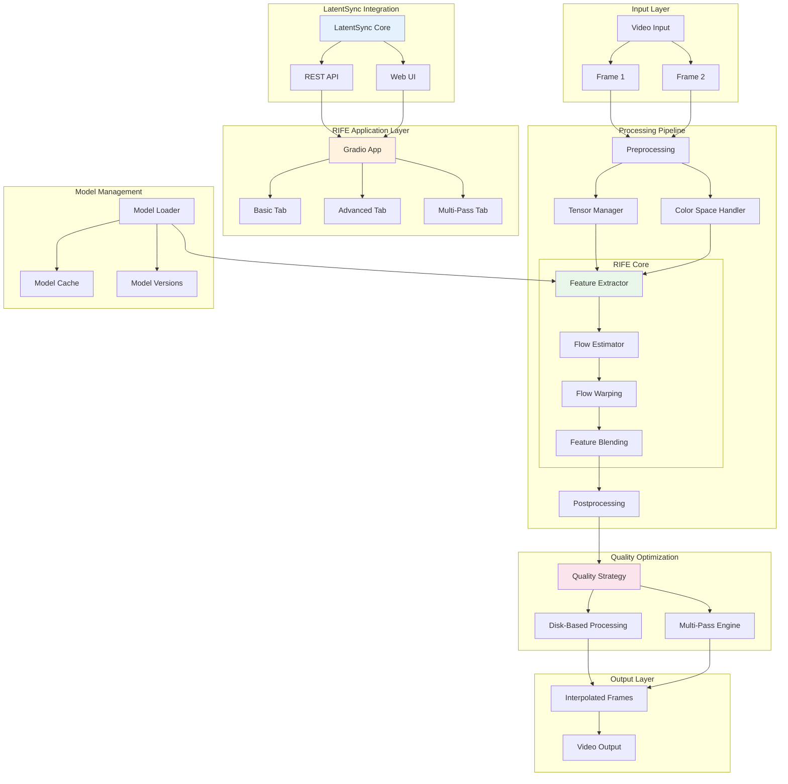
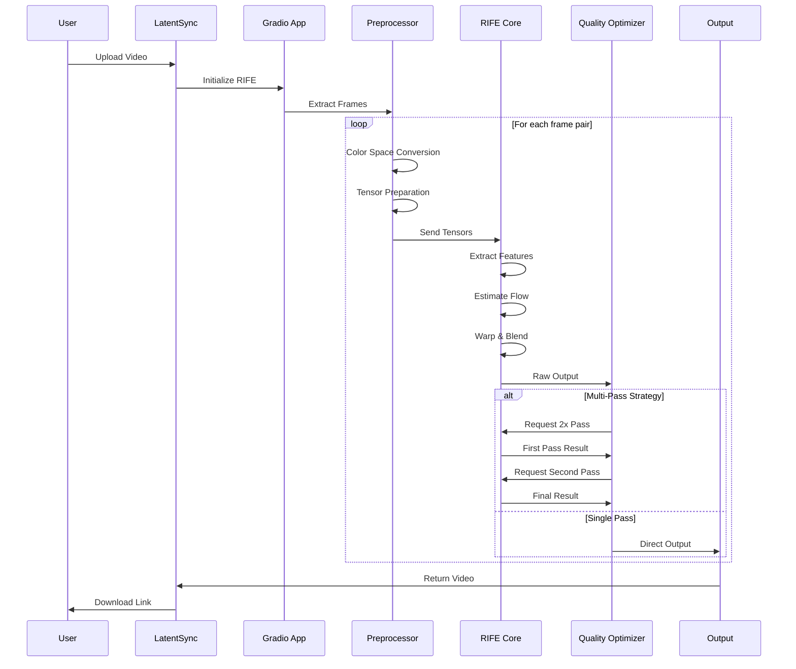
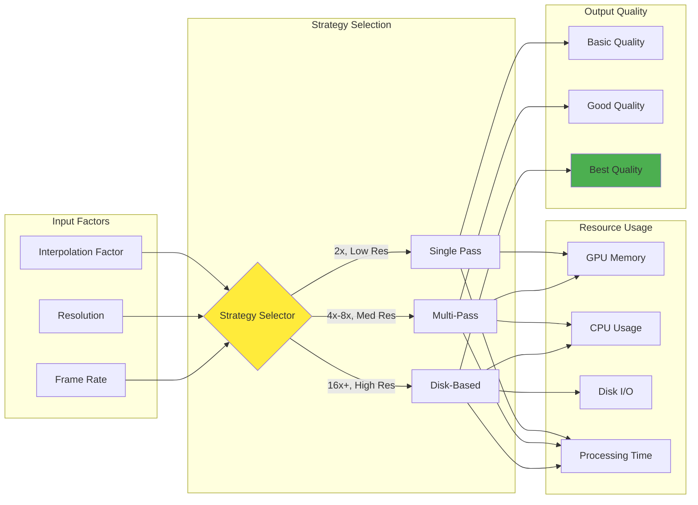
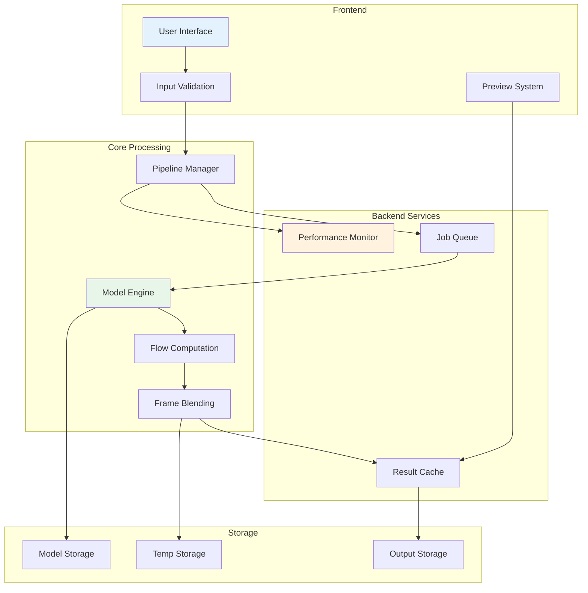
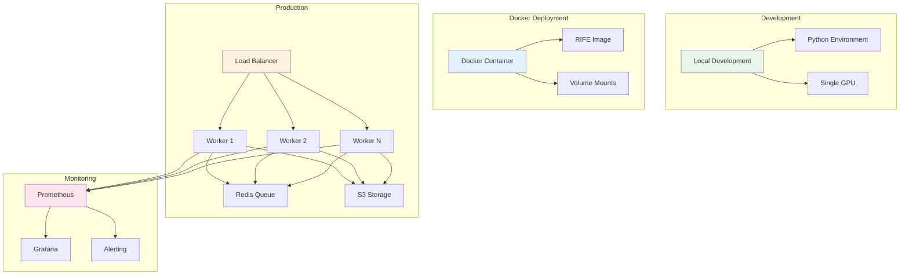

# RIFE System Overview

This document provides a high-level visual overview of the RIFE frame interpolation system integrated with LatentSync.

## Complete System Architecture

## Data Flow Pipeline

## Quality vs Performance Trade-offs

## Key Components Interaction

## Deployment Options

## Navigation

- **[Back to Documentation Hub](./README.md)**
- **[Technical Details](./RIFE_COMPLETE_GUIDE.md)**
- **[Deployment Guide](./DEPLOYMENT_GUIDE.md)**
- **[Quality Optimization](./QUALITY_AND_OPTIMIZATION.md)**
- **[Technical Solutions](./TECHNICAL_FIXES.md)**