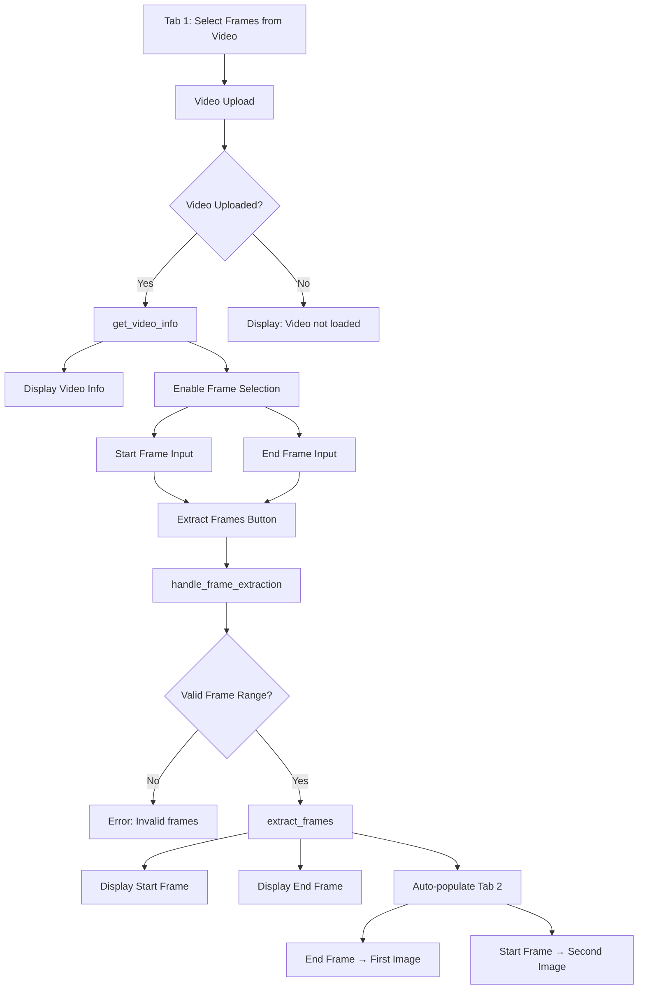
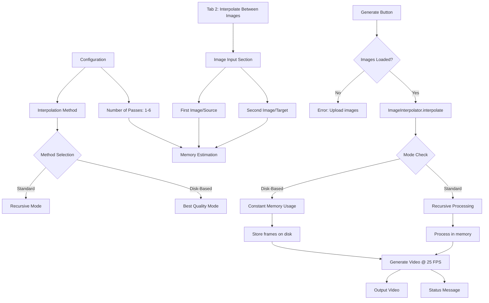
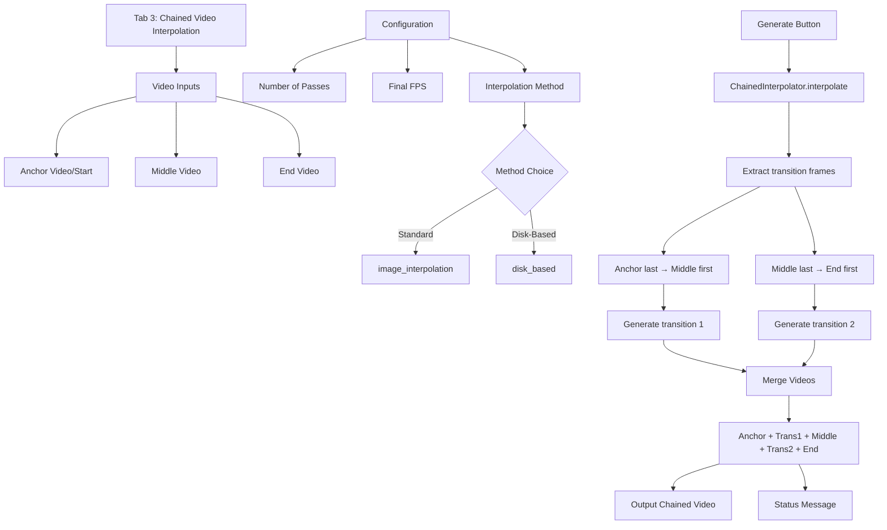
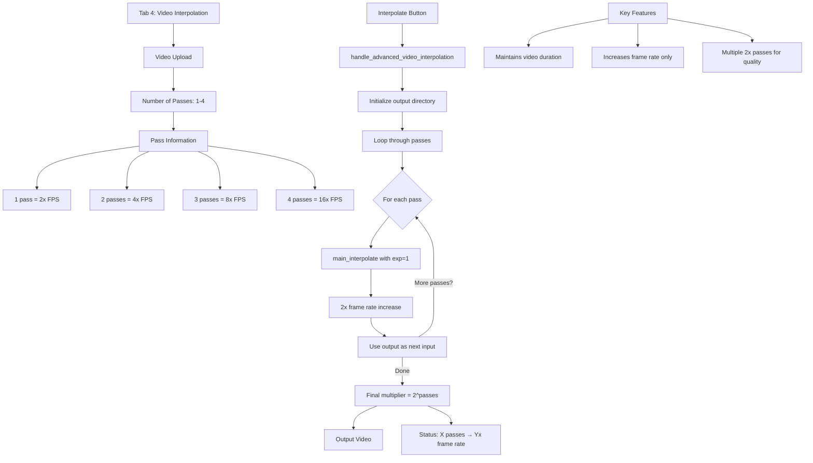
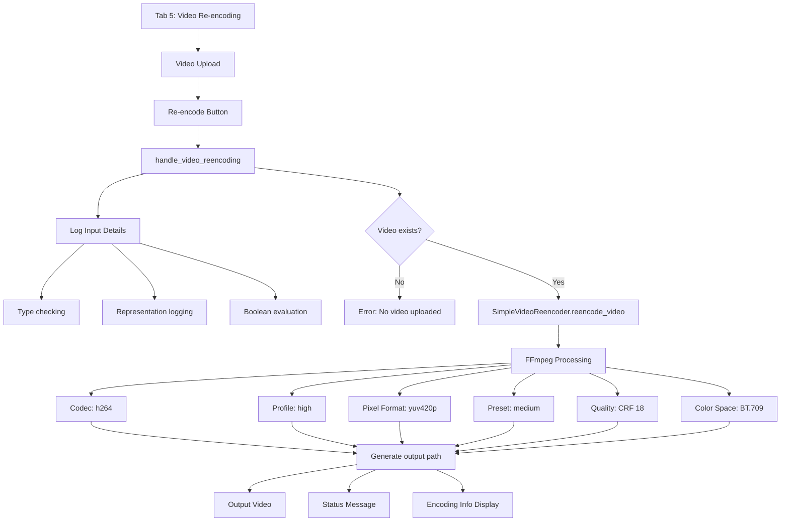

# RIFE Application Tab Diagrams

This document contains Mermaid diagrams for each tab in the RIFE application (`app.py`).

## Tab 1: Select Frames from Video

## Tab 2: Interpolate Between Images

## Tab 3: Chained Video Interpolation

## Tab 4: Video Interpolation

## Tab 5: Video Re-encoding

## Summary

These diagrams illustrate the flow and logic of each tab in the RIFE application:

1. **Tab 1** - Frame Extraction: Handles video frame extraction with validation and auto-populates Tab 2 with reversed frame order
2. **Tab 2** - Image Interpolation: Performs image interpolation with memory-efficient options (standard recursive or disk-based)
3. **Tab 3** - Chained Video Interpolation: Chains multiple videos with smooth transitions between them
4. **Tab 4** - Video Interpolation: Increases video frame rate using multiple 2x passes while maintaining duration
5. **Tab 5** - Video Re-encoding: Re-encodes videos with professional standards using FFmpeg

Each diagram shows the key components, decision points, and data flow for its respective functionality.